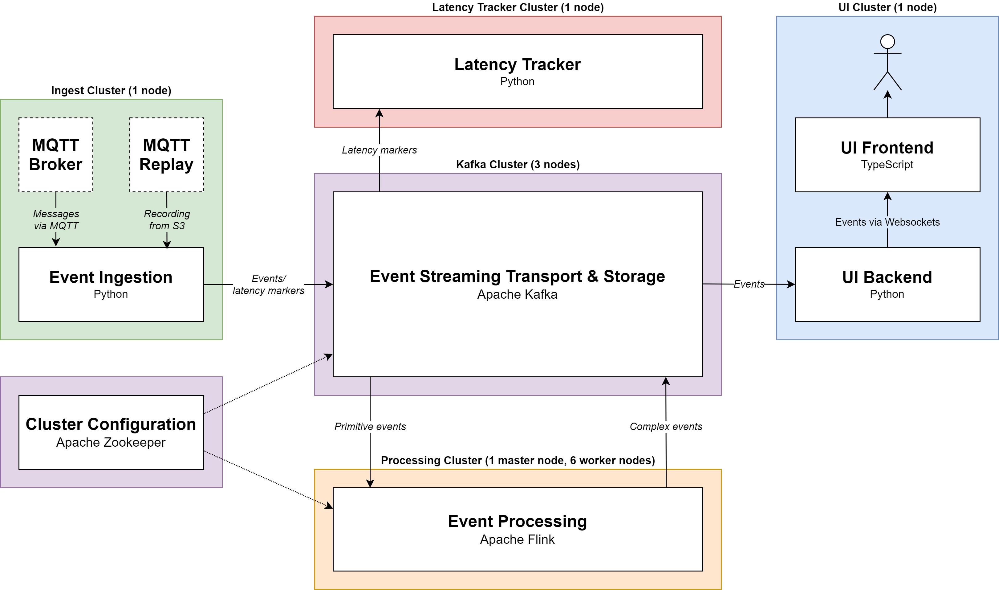

# PT Insight - Real-Time Analysis of Public Transportation Data

This is a demo application for large-scale complex event processing. It will be referred to as "PT Insight" (Public Transportation Insight).
For general documentation, see `docs`. For component-specific documentation, see their folders.


## Use Case
* Ingest real-time event stream from [Helsinki Public Transportation API](https://digitransit.fi/en/developers/apis/4-realtime-api/)
* Ingest other [data like schedules, routes, service information](https://digitransit.fi/en/developers/apis/1-routing-api/), ...
* Analyze for following:
    * Detect incidents/deviations from schedule and correlate with service information
    * Detect busiest places with respect to number of arrivals
    * Detect routes with highest speeds and accelerations
* Display that information in a heatmap as overlay for a city map


## Requirements
* Resiliency to failures:
    * Requires state checkpoints


## Architecture




## Directory Structure
* `analysis`: Jupyter notebooks for latency and data analysis
* `ansible`: Ansible playbook and roles to setup and deploy the PT Insight system
* `common`: Common libraries shared between components, including protobuf definitions
* `docs`: Detailed docs for system-wide components
* `ingest`: Component for ingesting external events into the PT Insight system
* `latencytracker`: Component for tracking end-to-end latency of the PT Insight system
* `processing`: Component for performing streaming analytics (Flink jobs)
* `terraform`: Terraform configuration files for cloud infrastructure setup
* `ui`: Component for visualizing events


## Development

### Environment Setup
Set up your environment as described in the [top-level README](../README.md), and set up the individual components as desribed in their READMEs.
Then add your IP address block to the `trusted_cidr` variable in `terraform/variables.tf` to grant access to EC2 instances from your computer.

### Deployment

1. Initialize Terraform
```
make init
```

_Note: Steps 2-4 can be executed in a single command using `make all`, which is equivalent to `make apply setup deploy`_

2. Set up infrastructure using Terraform. Rerun this step when you change the AWS setup in the .tf files.
```
make apply

# Alternatively when you want to rebuild an existing infrastructure
make reapply  # equivalent to "make destroy apply"
```

3. Install platforms (Java, Python, Flink, Kafka...). Rerun this step when you change server configurations.
```
make setup

# Alternatively for individual components:
make setup-zookeeper
make setup-kafka
make setup-processing
make setup-ingest
make setup-ui
make setup-latencytracker
```

4. Deploy applications. Rerun this step when you change application code.
```
make deploy

# Alternatively for individual components:
make deploy-kafka
make deploy-processing
make deploy-ingest
make deploy-ui
make deploy-latencytracker
```

5. Open the UI in your browser
```
make show-hosts  # get UI host
Navigate to http://ui-host:8080/
```

6. SSH into the servers
```
./ssh.sh kafka [0-2]
./ssh.sh flink_master
./ssh.sh flink_worker [0-5]
./ssh.sh ingest
./ssh.sh ui
./ssh.sh latencytracker
```

7. Destroy infrastructure when it is not needed anymore
```
make destroy
```

## Links
* List of Helsinki APIs: https://www.notion.so/faa753c34e1f469d92750c13f7f9d0d8?v=ba0f9f25b9a34d31afba6d05db2ffa96
