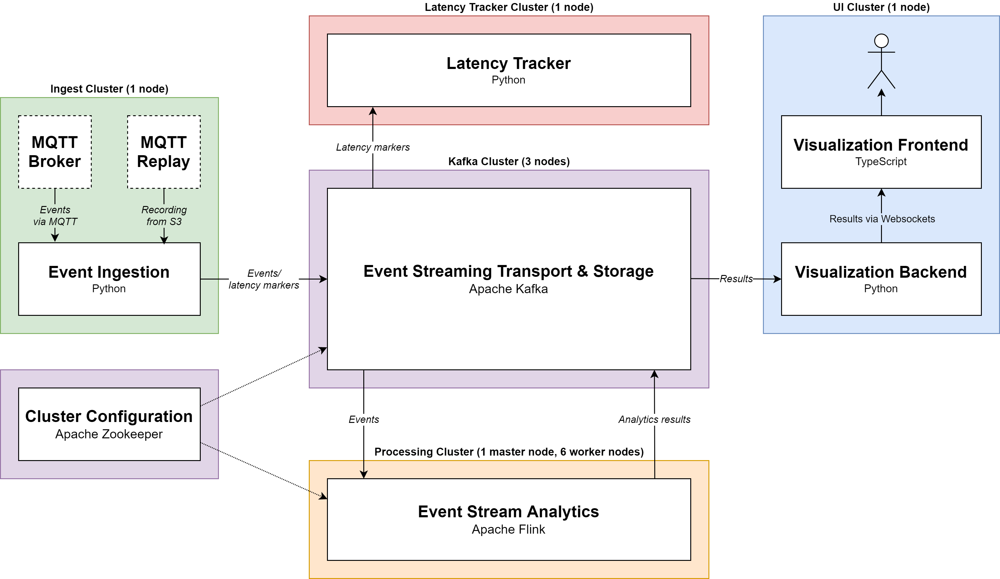

# PT Insight - Real-Time Analysis of Public Transportation Data

This is a demo application for large-scale complex event processing. It will be referred to as "PT Insight" (Public Transportation Insight).
For general documentations, see `docs/`. For component-specific documentation, see their folders.


## Use Case
* Ingest real-time event stream from [Helsinki Public Transportation API](https://digitransit.fi/en/developers/apis/4-realtime-api/)
* Ingest other [data like schedules, routes, service information](https://digitransit.fi/en/developers/apis/1-routing-api/), ...
* Analyze for following:
    * Detect incidents/deviations from schedule and correlate with service information
    * Detect busiest places with respect to number of arrivals
    * Detect routes with highest speeds and accelerations
* Display that information in a heatmap as overlay for a city map


## Requirements
* Resiliency to failures:
    * Requires state checkpoints and re-deployment of app to new server (Docker can aid fast deployment)


## Architecture




## Directory Structure
* `ansible`: Ansible playbook and roles to setup and deploy the PT Insight system
* `common`: Common libraries shared between components, including protobuf definitions
* `docs`: Detailed docs for system-wide components
* `ingest`: Component for ingesting external events into the PT Insight system
* `processing`: Component for detecting complex events
* `terraform`: Terraform configuration files for cloud infrastructure setup
* `ui`: Component for visualizing events


## Development

### Environment Setup
Set up your environment as described in the [top-level README](../README.md), and set up the individual components as desribed in their READMEs. Then add your IP address block to the `trusted_cidr` variable in `terraform/variables.tf` to grant access to EC2 instances from your computer.

### Deployment

1. Initialize Terraform
```
make init
```

_Note: Steps 2-4 can be executed in a single command using `make all`_

2. Set up infrastructure using Terraform
```
make apply
```

3. Install platforms (Java, Python, Flink, Kafka...). Rerun this step when you change server configurations.
```
make setup
```

4. Deploy applications
```
make deploy
```

5. Open the UI in your browser
```
make show-hosts # get UI host
Navigate to http://ui-host:8080/
```

6. SSH into the servers
```
./ssh.sh processing 0  # Flink + Kafka + Zookeeper
./ssh.sh processing 1
./ssh.sh processing 2
./ssh.sh ingest
./ssh.sh ui
```


## Makefile Targets

* `all`: apply, setup, deploy
* `apply`: Set up AWS infrastructure
* `destroy`: Destroy AWS infrastructure
* `reapply`: Destroy, then set up AWS infrastructure
* `setup`: Install platforms
* `setup-zookeeper`: Setup Zookeeper
* `setup-kafka`: Setup Kafka
* `setup-processing`: Setup processing
* `setup-ingest`: Setup ingest
* `setup-ui`: Setup UI
* `deploy`: Deploy everything
* `deploy-kafka`: Deploy Kafka
* `deploy-processing`: Deploy processing
* `deploy-ingest`: Deploy ingest
* `deploy-ui`: Deploy UI
* `show-hosts`: Show addresses of hosts

## Links
* List of Helsinki APIs: https://www.notion.so/faa753c34e1f469d92750c13f7f9d0d8?v=ba0f9f25b9a34d31afba6d05db2ffa96

## Todo
* Use Prometheus for metrics monitoring
