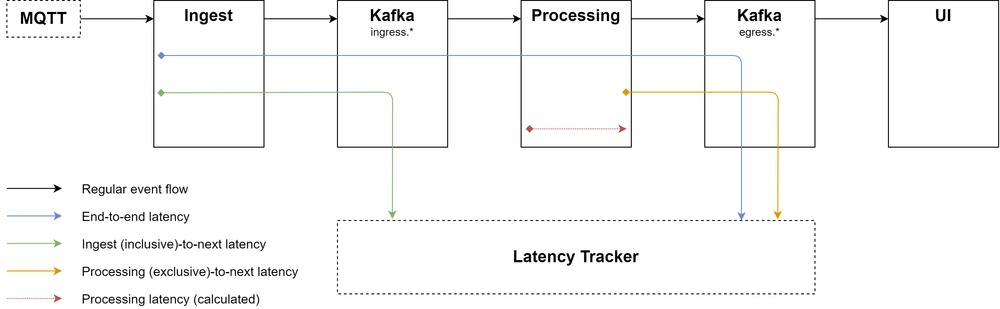

# Latency Tracking

Measuring end-to-end latency, i.e. the delay between the ingestion of an event by the system and the time at which results based on this event become visible, is important to evaluate the response of a stream processing platform to different load levels. While Flink supports [latency tracking out of the box](https://ci.apache.org/projects/flink/flink-docs-stable/monitoring/metrics.html#latency-tracking), this method only regards network latency but not operator and window latency, therefore reflecting only part of the complete end-to-end latency. Additionally, it can have a significant performance impact.

Therefore, we use our own latency tracking system with latency marker records that are inserted into the regular stream and evaluated by an additional latency tracker component. Latency markers use a special geolocation (for example a geocell that would not occur in regular events) to distinguish them from real events without needing to explicitly support them inside the processing job. Therefore they experience the same latency as real events, including checkpointing latency, which can be significant if the state is large. Latency markers are timestamped at their creation, so the latency can be calculated as the difference of the creation timestamp and the timestamp of the marker's arrival at the latency tracker.

Since aggregating window operations can collapse multiple records into a single one, all latency markers must have different geolocations so they can be tracked indivividually from end to end at all times, retaining a one-to-one relationship between latency marker and aggregation result. For example, sequential geolocations can be generated by spiraling outwards from some starting location.

## Latency metrics

The figure below shows the system components, the regular event flow and the latency metrics that we measure. We assume that the transport latency from Kafka to all downstream components is identical, e.g., the time from Kafka ingress topics to processing is the same as the time from Kafka ingress topics to the latency tracker. This allows us to measure and calculate the following metrics:
* End-to-end (blue): arrival in system until display in UI
* Ingest (inclusive)-to-processing (green): arrival in system until consumed by processing via Kafka
* Processing (exclusive)-to-UI (orange): emitted by processing until consumed by UI via Kafka
* Processing (red): arrival in Flink until emission to Kafka, End-to-end *minus* processing (exclusive)-to-UI *minus* ingest (inclusive)-to-processing
Note that latency markers are either created at the beginning of the ingest component (so ingest computations are included) or at the end of the processing component (so processing computations are not included).

Let us regard an example. We want to measure the latencies of the vehicle count job, which counts the number of vehicles per geocell in the last 30 seconds, evaluated every 5 seconds. Vehicle position events arrive every second but are deduplicated by vehicle, so only the last position of the vehicle in the window is regarded. Latency markers are emitted at a certain interval and take the same route as regular events.  
The end-to-end latency is the time it takes the latency marker from its emission at the beginning of the ingest component as pseudo vehicle position through the processing component to its arrival at the UI component. Since events are aggregated by being counted per geocell, we can detect the arrival when we see the count for the marker's special geocell.  
The ingest-to-processing latency is the time it takes the latency marker from its emission at the beginning of the ingest component to its arrival at the latency tracker, assuming the Kafka-Processing and Kafka-Latency Tracker are identical.
The processing-to-UI latency is the time it takes the latency marker from its emission at the end of the processing component to its arrival at the latency tracker, assuming the Kafka-UI and Kafka-Latency Tracker are identical.
The processing latency is the time the latency marker spends in Flink. Since records travel through the Flink cluster with various sources of latency and aggregations, this latency cannot be measured directly. Rather, it can be calculates as difference of the end-to-end latency and all other latencies.

## Accuracy
The latency measured from markers reflects the latency of real events only with some uncertainty introduced by:
* The assumption that the transport latency from Kafka to all downstream components is identical, while in reality may vary slightly due to different network routes, or when backpressure is triggered in Flink and records cannot be consumed at the pace that they are produced, which is not experienced by the latency tracker
* The much lower volume of marker records per geocell aggregation than the volume of regular records, therefore the processing time for marker records is generally lower. However, we assume the time spent in processing functions (e.g., counting or evicting) is negligibly small (less than 10 ms).
* Caching effects in async functions which are not represented accurately with latency markers since the distribution of already seen and new queries might be different between real records and marker records, and query response times might be different for latency markers which will not have valid query results
* The system time on different systems varying slightly. However, we sync the system times on all participating servers via NTP to the Amazon AWS time servers.
